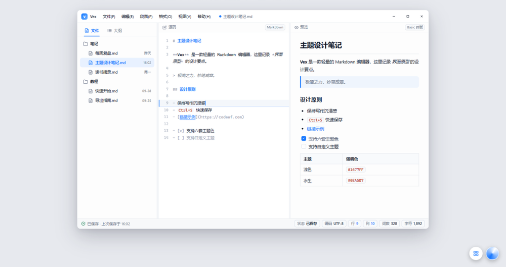
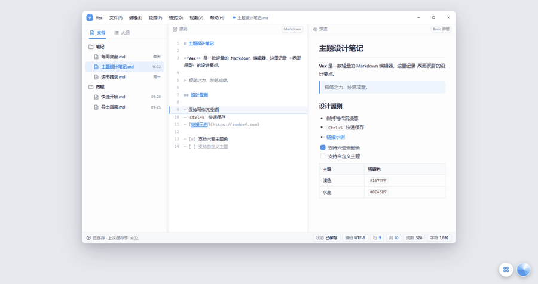

# Vex

Vex（维刻）是一个基于 .NET 10 与 Avalonia 12 构建的跨平台 Markdown 编辑器，面向日常写作、技术文档整理、自媒体排版和多格式文档导出。

Slogan：极简之力，妙笔成章。

作者：沙漠尽头的狼  
出品：码坊 CodeWF  
网站：https://codewf.com





## 下载安装

从 [GitHub Releases](https://github.com/dotnet9/Vex/releases/latest) 下载最新安装包（附 `.sha256` 校验）：


- Windows x64：`Vex-v*-win-x64-setup.exe`
- Linux x64 / arm64：`Vex-*-linux-x64.deb`、`Vex-*-linux-arm64.deb`
- macOS x64 / arm64：`Vex-*-osx-x64.dmg`、`Vex-*-osx-arm64.dmg`

## 仓库规范

- 当前版本：`1.4.0`，版本号统一维护在根目录 `Directory.Build.props` 的 `<Version>` 节点。
- NuGet 包项目统一支持 `net8.0;net10.0`；Demo、App、测试与内部应用项目统一使用 `net10.0` / `net10.0-windows`。
- 根目录 `logo.svg`、`logo.png`、`logo.ico` 是唯一图标源，子工程只通过 MSBuild `Link` 引用，不维护图标副本。
- 运行时帮助、Markdown 示例、内置备忘录、设计说明等业务文档按功能保留；仓库级入口文档使用根目录 `README.md` 和 `UpdateLog.md`。

## 项目定位

Vex 希望提供一个轻量、清爽、可离线使用的 Markdown 写作环境。它不是单纯的代码编辑器，也不是只做预览的阅读器，而是围绕 Markdown 文档的完整工作流来设计：

- 写作时有源码编辑、实时预览、大纲导航和文档统计。
- 整理文档时可以打开单个文件或整个文件夹，快速在同目录文档之间切换。
- 发布时可以导出 HTML、PDF、PNG、Word，也可以复制为微信公众号、知乎、稀土掘金可直接粘贴的富 HTML。
- 分享时会尽量嵌入图片资源，让 PDF 和 Word 文件离线发送后仍能正常查看。
- 需要 AI 协作时，可以通过本机 MCP 接口让支持 MCP 的 AI 客户端读取、编辑、预览和保存当前文档。


## 主要功能

### Markdown 编辑

- 基于 AvaloniaEdit 的 Markdown 源码编辑器。
- 右侧实时预览，支持当前排版主题和紧凑布局。
- 支持常见 Markdown 编辑动作：标题、引用、列表、任务列表、表格、代码块、链接、图片等插入辅助。
- 支持从网页粘贴内容：优先读取剪贴板 HTML，并转换为 Markdown；无 HTML 或转换失败时回落到普通粘贴。

### 文件工作流

- 新建、打开、保存、另存为 Markdown 文档。
- 支持打开文件夹，左侧自动列出目录中的 Markdown/TXT 文档。
- 直接打开单个文件时，会自动加载同目录下的可编辑文档列表。
- 支持最近文件、拖拽打开、启动参数打开、文件重命名/删除，以及外部文件变更检测。

### 大纲、查找与统计

- 根据 Markdown 标题生成大纲，支持快速跳转。
- 状态栏显示保存状态、编码、行列位置、字数和字符数等文档信息。
- 支持查找和替换，包含区分大小写、整词匹配、正则匹配、命中计数和循环查找提示。
- 针对长文档的大纲扫描、统计、查找计数和预览刷新做了防抖与性能优化。

### 导出与分享

- 导出 HTML。
- 打印预览。
- 导出 PNG 长图。
- 导出 PDF，正文文本可选择、可复制，并支持页眉页脚。
- 导出 Word `.docx`，保留基础 Markdown 结构并嵌入图片。
- 复制到微信公众号、知乎、稀土掘金，生成适合网页编辑器粘贴的富 HTML 剪贴板内容。
- PDF、PNG 和 Word 导出复用 `CodeWF.Markdown` 12.1.2.14 的 `MarkdownDocumentExporter` / `ExportKind` 能力，支持本地相对图、`data:image`、HTTP(S) 图片、SVG/GIF/WebP 转 PNG。

### 外观与本地化

- 支持浅色/深色主题。
- 支持多套 Markdown 排版主题和紧凑布局。
- 支持行号、状态栏、窗口置顶等视图选项。
- 内置简体中文、繁体中文、英文、日文界面资源。
- 帮助文档、快速开始、更新日志和鸣谢文档会随发布产物一起输出。

### MCP 与 AI 协作

- 内置本机 MCP Server，入口位于“帮助 -> MCP 设置”，可设置启用状态、监听地址、端口、授权 Token 和访问范围。
- 默认使用本机 loopback 地址，例如 `http://127.0.0.1:17891/mcp/`，并通过 Bearer Token 鉴权。
- 暴露当前文档读取、选区读取、大纲读取、渲染 HTML 读取、应用状态读取、操作审计读取、工作区文件列表等只读工具。
- 暴露整体替换文档、按 offset 应用文本编辑、插入文本、替换选区、查找替换（`vex_replace_text`，查找串需唯一）、打开/新建授权范围内文档、保存当前文档、撤销/重做（`vex_undo` / `vex_redo`）等文档工具，共 29 个工具。
- 实现 MCP `resources` 能力：`resources/list`、`resources/read` 暴露当前文档（`vex://current-document`）与工作区文件（`vex://file/<完整路径>`），读取同样受访问范围约束。
- 暴露基础界面操作工具，包括读取界面状态、切换主题、切换排版、切换语言、切换侧边栏/预览/源码模式、打开基础面板、执行常用编辑命令、触发现有导出和复制富 HTML 流程。
- AI 编辑会更新 Vex 当前文档状态，并实时刷新编辑器、预览、大纲和状态栏。
- 文档编辑、打开文档、保存当前文档、复制富 HTML 默认需要用户确认；确认弹窗支持勾选"本次运行内记住此选择"，对单个工具在本次运行内免询问（执行 = 始终允许，取消 = 始终拒绝），重新保存 MCP 设置后重置；打开文档时若当前文档有未保存修改，还会先走应用的未保存更改确认流程。
- 不向 AI 暴露删除、打印、新窗口、全屏、置顶、打开外部网站、反馈、新手引导、清空最近文档、打开文件所在位置、剪切、粘贴等高意图或系统级操作。
- MCP 工具名对外使用 OpenAI function calling 兼容的下划线格式，例如 `vex_get_current_document`；旧的 `vex.get_current_document` 调用会由服务端兼容归一化。
- MCP 协议和工具分发采用手写 JSON-RPC、静态工具 schema 和 `System.Text.Json` source generation，避免反射扫描工具方法，保持 Native AOT 兼容。
- 接口为本机 HTTP JSON-RPC 形式，面向支持 HTTP + Bearer Token 方式接入 MCP 的 AI 客户端；标准 stdio MCP 客户端（Claude Desktop、Cursor 等）可使用附带的桥接脚本接入：
  ```json
  {
    "mcpServers": {
      "vex": {
        "command": "python",
        "args": ["<安装或仓库目录>/scripts/mcp_stdio_bridge.py"],
        "env": { "VEX_MCP_TOKEN": "<MCP 设置中生成的 Token>" }
      }
    }
  }
  ```
- MCP 操作审计持久化到 `%LOCALAPPDATA%\Vex\mcp-audit.jsonl`（超 1MB 自动轮转），帮助菜单提供"MCP 操作审计"查看窗口；状态栏常驻 MCP 服务指示器。
- HTTP 端点基于 `HttpListener` 托管实现，理论上跨平台可用，但 linux/macOS 未经系统级实测；所有 29 个工具描述随界面语言本地化（zh-CN / zh-Hant / en-US / ja-JP）。

### 发布产物

- 支持 `win-x64`、`linux-x64`、`linux-arm64`、`osx-x64`、`osx-arm64` 多 RID 发布（NativeAOT，单文件 + 压缩）。
- GitHub Release 资产为安装包：Windows exe（Inno Setup 中文向导）、Linux deb、macOS dmg，均附 `.sha256`。
- 本地仍可用 `package_all.bat` 生成 `Vex-v<Version>-<RID>.zip` 便携包（排除 `*.pdb`，附 SHA256 与 release manifest）；Windows 也可选生成 MSIX 布局/安装包。

## 技术栈

- .NET 10
- Avalonia 12
- AvaloniaEdit
- Prism.Avalonia
- ReactiveUI.Avalonia
- Ursa.Avalonia / Semi.Avalonia
- CodeWF.Markdown
- CodeWF.EventBus
- Lang.Avalonia.Json

## 快速开始

```powershell
dotnet restore Vex.slnx
dotnet build Vex.slnx -v:minimal
dotnet run --project src\Vex\Vex.csproj -f net10.0
```

更多使用说明见 [docs/快速开始.md](docs/快速开始.md)。

## 构建与发布

```powershell
dotnet build Vex.slnx -v:minimal
.\publish_all.bat
.\package_all.bat
.\package_all.bat --force
.\scripts\package_vex_msix.ps1 -RuntimeIdentifier win-x64 -PrepareOnly
.\scripts\package_vex_msix.ps1 -RuntimeIdentifier win-x64 -CertificatePath .\cert.pfx
```

`publish_all.bat` 会将配置好的运行时发布到 `publish/<RID>/`。

`package_all.bat` 会先调用 `publish_all.bat`，再在 `artifacts/release/` 下生成 `Vex-v<Version>-<RID>.zip`、SHA256 文件和 release manifest。

Release 压缩包会排除 `*.pdb` 调试符号文件。已有产物默认不会覆盖；需要覆盖时使用 `package_all.bat --force`，或直接给 PowerShell 脚本传入 `-Force`。

`scripts/package_vex_msix.ps1` 会在 `artifacts/installer/msix-layout/<RID>/` 下创建 Windows MSIX 布局；不传 `-PrepareOnly` 时，会调用 Windows SDK `makeappx.exe` 生成 `artifacts/installer/Vex-<Version>-<RID>.msix`，并在提供 `-CertificatePath` 时使用 `signtool.exe` 签名。

## 文档

- [快速开始](docs/快速开始.md)
- [更新日志](UpdateLog.md)
- [MCP 功能实现方案](docs/MCP功能实现方案.md)
- [鸣谢](docs/鸣谢.md)

## 开源致谢

Vex 使用并感谢以下开源项目：

- [Avalonia](https://avaloniaui.net/)
- [Prism.Avalonia](https://github.com/AvaloniaCommunity/Prism.Avalonia)
- [Semi.Avalonia](https://github.com/irihitech/Semi.Avalonia)
- [Ursa.Avalonia](https://github.com/irihitech/Ursa.Avalonia)
- [CodeWF.Markdown](https://github.com/dotnet9/CodeWF.Markdown)
- [CodeWF.EventBus](https://github.com/dotnet9/CodeWF.EventBus)
- [AvaloniaEdit](https://github.com/AvaloniaUI/AvaloniaEdit)
- [Markdig](https://github.com/xoofx/markdig)

## 许可证

MIT，详见 [LICENSE](LICENSE)。

## 包版本维护约定

XML 文件统一使用两个空格缩进。`Directory.Packages.props` 统一承载 NuGet 中央包管理开关和包版本变量，包括 `AvaloniaVersion` 等共享版本属性；`Directory.Build.props` 仅保留项目构建、编译选项和 NuGet 元数据。仓库如引用 `VC-LTL`、`YY-Thunks`，这两个兼容旧版操作系统的特殊包必须使用最新预览版。

## CI/CD：自动发布

推送 `v*` 标签（例如 `v1.1.2.7`，与 `Directory.Build.props` 的 `<Version>` 一致）会同时触发两个工作流：

**[publish-nuget.yml](.github/workflows/publish-nuget.yml)**：发布 `Vex.Controls`、`Vex.Controls.Themes` 到 nuget.org（NuGet Trusted Publishing，仓库不存 secret）。

**[release.yml](.github/workflows/release.yml)**：为五个平台（win-x64 / linux-x64 / linux-arm64 / osx-x64 / osx-arm64）构建并制作安装包——Windows 用 Inno Setup 中文向导（NativeAOT 裁剪）、Linux 用 deb、macOS 用 dmg（标准 .app 镜像），最后创建 GitHub Release。

## 发布

标准发布流程与发布说明规范见 [docs/RELEASE.md](docs/RELEASE.md)。
